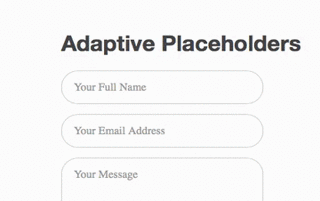
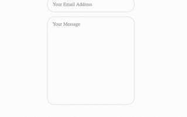

Adaptive Placeholders
====================

Adaptive placeholders is a Sass mixin for an interactive form placeholder initially made by [Danny King](https://twitter.com/dannykingme). 

This Sass mixin comes with additional settings to help you easily configure the placeholder to match your design. 

## Screenshot 

Adaptive Placeholder works with both text input fields and textarea. 

## Requirements 

Adaptive Placeholder uses Sass maps and requires Sass > v3.3. 

## Usage 

Add Adaptive Placeholders into your project and import it into your main stylesheet with 

    @import "pathToAdaptivePlaceholders/adaptive-placeholders"; 

Write your HTML in this way: 

    <form action="#">
        <!-- input must have an required attribute -->
        <input type="text" required>
        <!-- labels must have placeholder and alt attributes -->
        <label placeholder="First Placeholder Label" alt="Second Placeholder Label"></label>
    </form>

Then call the mixin. 

    input {
        @include adaptive-placeholder();
    }

## Customizing Adaptive Placeholder. 

Adaptive placeholder comes with a set of defaults ready to use. 

    $adaptive-placeholder: (
      height: 3em,
      margin: 1em,
      border: 1px,
      border-radius: 1.5em,
      font-size: 1em,
      border-color: #cccccc,
      label-color: #999999,
      active-color: #e87e22,
      valid-color: #23a045,
      placeholder-background-color: white,
      textarea: false
      );

You can create your own settings for adaptive-placeholder by creating a Sass map named $adaptive-placeholder. Any defaults not overwritten will be added to the Sass map. 

    // Defining new defaults
    $adaptive-placeholder: (
        height: 4em; 
    )

    // Calling Adaptive placeholders
    input {
        @include adaptive-placeholder(); 
    }

The adaptive placeholders provides you with a optional argument to insert a sass map if you would like to keep the defaults intact, or would like to include a second style. 

    input {
        @include adaptive-placeholder($optional-map); 
    }

## Working with Textareas 

Textareas are styled differently from inputs items. To use adaptive placeholders with textareas, write your html the same way as you would use adaptive placeholders for input. 

    <form action="">
        <textarea required></textarea>
        <label placeholder="First Textarea Placeholder" alt="Second Textarea Placeholder"></label>
    </form>

Create a new sass map for textareas and call it. Make sure textarea is set to true in the sass map. 

    $textarea-placeholder : (
        height: 18em, 
        border-radius: 6px,
        textarea: true, 
    )
    // Call textarea placeholder 
    textarea {
        @include adaptive-placeholder($textarea-placeholder); 
    }

Alternatively, you can insert the sass map directly into the mixin. 

    // Call textarea placeholder 
    textarea {
        @include adaptive-placeholder((height: 18em, border-radius: 6px, textarea:true)); 
    }

## Browser Tests

Works on IE9+, Firefox 28+, Chrome 31+, Safari 7+.

## Credits 

@ Danny King for the concept and initial code. The original Less code can be found [here](http://codepen.io/dannykingme/pen/IvFuB)

## License 

MIT License. 